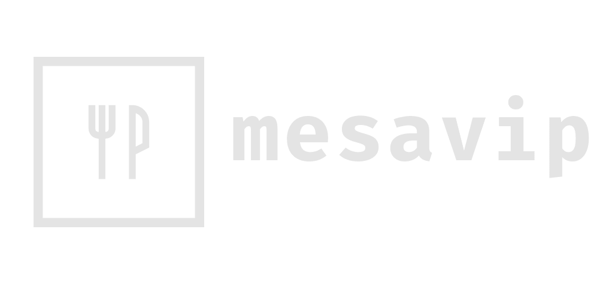

<h1 align="center">
  
</h1>

<h3 align="center"> Mesavip helps you making reservations in your favorite restaurants. </h3>

<br>
<p align="center">
 
  <a href="https://mesavip.netlify.app" target="_blank" style="text-decoration:none" color="red">
    
  </a>
  
  <a href="https://github.com/danielmarques12/mesavip-web" target="_blank">
    
  </a>
  
  <a href="https://www.figma.com/file/mv6AkW8Z2HLsKrvG2FXLuI/MESAVIP?node-id=0%3A1" target="_blank">
    
  </a>
  
  <a href="https://raw.githubusercontent.com/danielmarques12/mesavip-api-tsc/main/.github/database.png" target="_blank">
    
  </a>
  
  <a href="https://www.notion.so/Queries-0697a2735333468a85ab69a96ec10a90" target="_blank">
    
  </a>
  
</p>

### Instalation guide/details

```bash
# Create a PostgreSQL database and put the credentials in the .env file.

# Before perfoming any I/O operation, execute the command below in the database.
# (This will provide functions to the database to generate the uuids):
postgres=$ CREATE EXTENSION IF NOT EXISTS "uuid-ossp"

# You can find the database model and the Insomnia requests collection inside the .github folder.

# To to install the dependencies
$ yarn

# To create the tables in the database
$ yarn knex migrate:latest

# To create the seeds in the database
$ yarn knex seed:run

# To start the api
$ yarn dev
```
